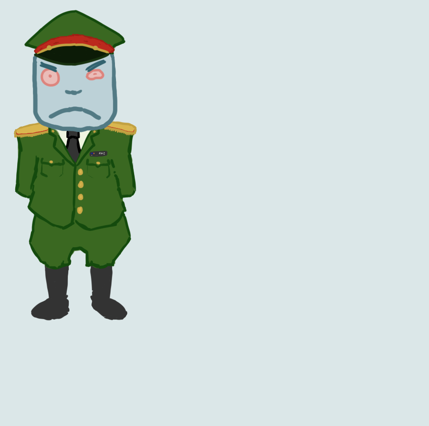

***

# ***My own little dictatorship***

***
The Jiharing Studio
Paralelo 2 - Taller de creación de videojuegos

Vicente Trincado
Sebastián Meneses

Actualización: Noviembre 24, 2020

# Tabla de contenidos
[TOC]

# Descripción General
Eres un dictador que tiene como objetivo ser idolatrado por su gente, por lo que el jugador realizará distintos proyectos con este fin. El problema es que tu gabinete de ministros podrá oponerse a tus decisiones, por lo que puedes realizar distintas acciones para evitar estos impedimentos (cada acción tendrá su propia consecuencia). Ganar significa realizar una cantidad de proyectos, lo que hará finalmente que tu pueblo te idolatre, mientras que perderás si todos tus ministros se rebelan contra ti.

# Jugabilidad y Mecánicas
## _Core Gameplay_

_My own little dictatorship_ es un juego de estrategia, donde se espera que el jugador adquiera la habilidad de modificar constantemente un gabinete de ministros con el propósito de mejorar sus posibilidades de aprobar un proyecto de gobierno. El *Core Loop* se divide principalmente en cuatro etapas:

* **Etapa 1:** El jugador selecciona un proyecto para proponer a sus ministros.
* **Etapa 2:** Los ministros votan por la aprobación de la propuesta.
* **Etapa 3:** El jugador analiza los resultados de la votación y decide qué cambios debe hacer a su gabinete.

* **Etapa 4:** El jugador cambia a sus ministros.

### Meta

El jugador gana la partida cuando obtiene al menos **6 puntos de victoria**, siempre y cuando éste tenga una **diferencia de al menos 2 PV** con el [enemigo](#enemigo). La misma condición se da para perder el juego, pero al revés; es decir, cuando gana el enemigo. Esto sucede cuando el enemigo obtiene al menos 6 PV, con una diferencia de al menos 2 PV con el jugador.

## Mecánicas
* **Proponer Proyecto:** El jugador puede escoger un proyecto de una lista para proponer a sus ministros. Solamente aquellos proyectos que no sean del alineamiento dominante del gabinete pueden ser propuestos.
* **Cambiar:** Elimina a uno de los ministros de un puesto, y lo cambia por otro con un nuevo alineamiento aleatoriamente definido.
* **Atacar `attack`:** Un ataque es una función que pueden realizar tanto el jugador como el enemigo. Consiste en consumir un punto de armamento para descontar un punto de victoria del contrincante. Esta acción se activa aprobando un proyecto patriota, y escogiendo la opción de atacar.

### Efectos de proyecto

  * **Patriota `patriotic`:** Al aprobar un proyecto patriota tienes la opción de adquirir un punto de victoria, o atacar.
  * **Humanista `humanistic`:** Al aprobar un proyecto humanista adquieres por un turno la habilidad de escoger por qué tipo de ministro deseas cambiar en la fase 4.
  * **Económico `economic`:** Al aprobar este proyecto adquieres un punto de armamento.
## Unidades
### Jugador

#### Atributos

* **Puntos de victoria:** _int_ Necesario para ganar. Se obtiene aprobando proyectos patriotas.
* **Puntos de armamento:** _int_ Necesario para atacar. Se obtiene aprobando proyectos económicos, y se consume atacando.
* **Proyectos aprobados:** Cantidad de proyectos aprobados, ordenados por alineamiento de proyecto.

### Ministro

#### Atributos

* **Nombre `name`:** _string_ Nombre y apellido del ministro. Generados aleatoriamente junto con el ministro. Su propósito es únicamente estético, no afecta la funcionalidad. Ej: "Roberto Pérez".

* **Puesto `seat`:** _enum_ Posición del ministro relativo a la mesa. Los enumeradores son letras mayúsculas que siguen la secuencia `A, B, C, ...`. A las 12 está el puesto `A`, y luego siguen secuencialmente en la dirección de las manillas del reloj. Su propósito es de organización interna.

* **[Obsoleto]. Cordura `sanity`:** _float_ Porcentaje que determina qué tan cuerdo es el ministro. El jugador pierde cuando todos [WIP] los ministros alcanzan el máximo de su cordura, por lo que el jugador siempre querrá mantener sus ministros lo menos cuerdos posible. Al generar un ministro, este inicia con un valor de cordura aleatorio entre 35-55%.

* **Alineamiento `alignment`:** _enum_ Preferencia de votación del ministro.

#### Métodos
* **Votar `Vote`:** _void_ Ministro vota respecto a la propuesta de proyecto. Si el proyecto es del mismo alineamiento del ministro, éste lo aprueba automáticamente. Si el proyecto no es del mismo alineamiento, el ministro vota al azar (50/50).

### Enemigo
#### Atributos

* **Puntos de victoria `victory points`:** _int_ Al igual que el jugador, el enemigo tiene puntos de victoria. Importante para determinar cuándo se pierde el juego. Los adquiere aleatoriamente al terminar la fase 4. 

* **Puntos de armamento `resource points`:** _int_ El enemigo también tiene puntos de armamento, que utiliza de la misma forma que el jugador. Los adquiere aleatoriamente al terminar la fase 4.

*  **Probabilidad de aprobar proyectos:** _float_ Probabilidad que tiene un enemigo de aprobar un proyecto. Constante a **70%**. Si aprueba un proyecto puede obtener un punto de victoria, u obtener un punto de armamento, o atacar.

### Proyecto

#### Atributos

* **Nombre `name`:** _string_ Nombre del proyecto. Se genera automáticamente. Propósito estético. A futuro estará asociado al alineamiento del proyecto. Ej: "Plaza de la nación", "Estadio del líder supremo", etc.
* **Nivel `level`:** No implementado aún.
* **Alineamiento `alignment`: **_enum_ Tipo de proyecto. Asociado a las preferencias de los ministros. Para más información ver <!--¿Ver qué?-->.

# Interfaces

# Propuesta de audio

Durante el _gameplay_ hay una pista de audio loopeable que suena constantemente. Ésta tiene un aire bélico, militar, y cómico. Además se integran efectos de sonido para las distintas acciones. Por ejemplo al cambiar ministros, al atacar al enemigo, al llamar a votaciones, etc. Se agregan también efectos de sonido que aportan una ambientación de oficina.

# Propuesta Visual
El juego estará hecho en 3D, y tendrá un estilo _low-poly_. Ambientación que recuerda a la propaganda de Corea del Norte. Uso extenso del color rojo en menús, y de tipo _Konstruktor_.

Los personajes como los ministros, o el enemigo son humanoides, y tienen proporciones de bebé. Su piel es de un color celeste poco saturado. La cabeza de los ministros es un modelo separado del cuerpo, puesto que éstos cambian de color su cabeza para significar su alineamiento.

_Concept art de los ministros_

# Bitácora de Iteraciones
## Prototipo 1 - Oct w3
El objetivo de este primer prototipo es descubrir y probar el _core loop_, implementando, completando, y desafiando las ideas propuestas en la fase inicial del proyecto. Se omiten algunas funciones planeadas en virtud del tiempo.

El prototipo consta de una sola pantalla que tiene un rectángulo café emulando una mesa, con siete ministros alrededor representados por círculos. Sobre la mesa hay ocho botones que representan cada proyecto. Los puestos de los ministros están nominados según su posición relativa a la mesa; a las 12 está el puesto `A`, y luego siguen secuencialmente en la dirección de las manillas del reloj. Los ministros y los proyectos están etiquetados por color, de tal forma que su alineamiento sea inmediatamente distinguible. Al proponer un proyecto se registran los votos de cada uno de los ministros en una sección a la derecha de la mesa.

El jugador gana cuando logra hacer **dos proyectos de cada tipo**, _i.e._ dos proyectos económicos, dos humanistas, y dos patriotas.  Por otro lado, el jugador pierde cuando **se llena completamente** la barra de [cordura](#ministro) de todos sus ministros.

* **Etapa 0:**  
  Se generan **7 ministros**, con nombres y alineamientos aleatorios.
  Se generan además **8 proyectos** aleatoriamente de todas las alineamientos. Aquellos que sean de la misma alineamiento que la alineamiento dominante del gabinete son inelegibles. Ej: Si 4/7 ministros son económicos, entonces los proyectos de tipo económicos no son elegibles.
  
* **Etapa 1:**  
  El jugador escoge el proyecto que desea proponer.

* **Etapa 2:**  
  [AUTOMÁTICO] Los ministros votan por los proyectos. Si el ministro es del mismo alineamiento que el proyecto, entonces aprueba la propuesta. Si no lo es, vota al azar con una probabilidad de 50/50. Este último es un comportamiento único a esta iteración.
  La aprobación se determina por mayoría de votos. Si hay un empate se repita le votación. Si vuelve a haber un empate se rechaza la propuesta.

* **Etapa 3:**  
  El jugador analiza los resultados de la votación e identifica si desea cambiar un ministro. En esta iteración toda la información respecto a la votación es pública.

* **Etapa 4:**  
  El jugador cambia a solo uno de los ministros si así lo desea. Al cambiar un ministro se hace un _reroll_ y se decide aleatoriamente el nuevo alineamiento.
  
## Alpha - Nov w3

El prototipo anterior fue presentado a un grupo acotado de jugadores en una instancia de reunión de _USM Games_. Los cambios efectuados en este _Alpha_ son reflejo de su retroalimentación, por la cual les agradecemos enormemente. 

En esta iteración se reformularon los objetivos del juego, se agregó un enemigo, y se cambió el enfoque del juego de una propuesta cómica a una estratégica. Además, se inicia la transición hacia un entorno 3D.
#### Meta
Como se puede ver en [_Core Gameplay_](#meta), ahora la meta del juego está íntimamente asociada a la adición de una nueva entidad, el [enemigo](#enemigo), que cambia la dinámica del juego hacia la estrategia. Éste es un reflejo incompleto del jugador, pues al igual que él puede atacar, obtener puntos, y aprobar proyectos. Sin embargo, no tiene ministros.
El objetivo es adquirir más puntos de victoria que el contrincante, con una determinada diferencia. Si así lo logra, el jugador gana la partida. Caso contrario, en que el enemigo cumple los requisitos, el jugador pierde.

#### Avances en el entorno 3D

_Progreso de transición a entorno 3D (Funcional)_

_Mockup del entorno 3D (No funcional)_

# Extras
# Referencias
# _Assets_ externos

## Unity Asset store
[JSON .NET For Unity](https://assetstore.unity.com/packages/tools/input-management/json-net-for-unity-11347)  
[Full Menu System](https://assetstore.unity.com/packages/tools/gui/full-menu-system-free-158919)  
[Voxel Wooden Funiture](https://assetstore.unity.com/packages/3d/props/furniture/voxel-wooden-funiture-67811)  
[City Voxel Pack](https://assetstore.unity.com/packages/3d/environments/urban/city-voxel-pack-136141)  
[Low Poly Office Props - LITE](https://assetstore.unity.com/packages/3d/environments/low-poly-office-props-lite-131438)  
[Snaps Prototype | Office](https://assetstore.unity.com/packages/3d/environments/snaps-prototype-office-137490)  
[Cartoon Low Poly City Pack Lite](https://assetstore.unity.com/packages/3d/environments/urban/cartoon-low-poly-city-pack-lite-166617)  
[Lowpoly Modern City Buildings Set](https://assetstore.unity.com/packages/3d/environments/urban/lowpoly-modern-city-buildings-set-64427)  
[Low Poly Storage Pack](https://assetstore.unity.com/packages/3d/environments/urban/low-poly-storage-pack-101732)  
[Low Poly Road Pack](https://assetstore.unity.com/packages/3d/environments/roadways/low-poly-road-pack-67288)  
## SFX
[Falling, Comedic, A.wav](https://freesound.org/people/InspectorJ/sounds/360662/)  
[Mouse click sounds](https://freesound.org/people/Masgame/sounds/347544/)  
[dot matrix printer.MP3](https://freesound.org/people/DisasterServices/sounds/320008/)  
[computer loading part 2](https://freesound.org/people/Fishh.com/sounds/531722/)
[TV Static.wav](https://freesound.org/people/Dean-Raul_DiArchangeli/sounds/116395/)  
[Grunts.wav](https://freesound.org/people/bennychico11/sounds/80438/)  
[Office Ambience](https://freesound.org/people/qubodup/sounds/199896/)  
[Indoor adult murmur, small group.wav](https://freesound.org/people/SpliceSound/sounds/260121/)  
[Murmur 1.wav](https://freesound.org/people/jayfrosting/sounds/333395/)  
[missile_launch_2](https://freesound.org/people/smcameron/sounds/51468/)  
[Ricochet](https://www.storyblocks.com/audio/stock/ricochet-sg8xkhahidhk0wxxqdu.html)

## Música
[National Spirit](https://www.storyblocks.com/audio/stock/national-spirit-semlm40nupbk0wy2qy0.html)  
[When Johnny Comes Marching](https://www.storyblocks.com/audio/stock/when-johnny-comes-marching-hxhg6er2ivhk0wy1lho.html)  
[Off Balance](https://www.storyblocks.com/audio/stock/off-balance-bgdvcp62udhk0wy0iir.html)  
_Trincado's favourite_[Spaghetti Gangster](https://www.storyblocks.com/audio/stock/spaghetti-gangster-bl1zkfu-oask4bq6h3c.html)  
[Pleasant and bouncy strings for light comedies, animation and children's content
Gerardo Garcia Jr.
](https://www.storyblocks.com/audio/stock/pleasant-and-bouncy-strings-for-light-comedies-animation-and-childrens-content-hhciaudzwkdz2ckld.html)  
